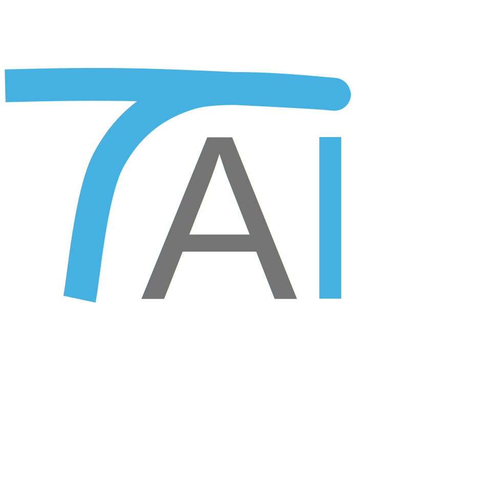

I am a tenure-track assistant professor in the AI Thrust at the [Hong Kong University of Science and Technology (Guangzhou)](https://www.hkust-gz.edu.cn/).
I recevied my Ph.D. degree from the [Pennsylvania State University](https://www.psu.edu/) under the supervision of [Dr. Suhang Wang](https://suhangwang.ist.psu.edu/). I obtained my Master of AI degree from Computer Science Department at [KU Leuven](https://www.kuleuven.be/english/). I received my Bachelor Degree from the [University of Science and Technology of China](https://www.ustc.edu.cn/). 

    

        [Open Positions]
    

    <ul style="font-size: 15px; color: black; font-weight: bold; margin-top: 0; margin-bottom: 10px; padding-left: 20px;">
        <li><strong>Research Assistant/Intern:</strong> Positions available anytime.</li>
        <li><strong>Master of Philosophy (M.Phil.):</strong> Fall 2026. (Admission decisions are made by the admission committee; admitted students or qualified applicants are encouraged to contact me in advance.)</li>
        <li><strong>Ph.D.:</strong> Fall 2027. (Master students or Bachelor students with strong research experience are encouraged to contact me in advance.)</li>
    </ul>
    

        Candidates with strong backgrounds in data mining, machine learning, mathematics, or related fields are encouraged to email their CV and transcript to <a href="mailto:enyandai@hkust-gz.edu.cn">enyandai@hkust-gz.edu.cn</a>, using the subject line "<strong>[RA/M.Phil./Ph.D. Application - Your Name]</strong>".
    

## Research Directions at (Trust & Application AI Lab)

I have wide research interests in Trustworthy AI and Applications of AI in the real-world scenarios.

    

<!-- <h3> Summary of Prior Works </h3>

    

    <article class="mini-post">
        
        
 <b> Fair Graph Neural Network </b> (WSDM-21) 
        <a href="https://arxiv.org/pdf/2009.01454.pdf" class="link">Paper</a> 
        <a href="https://github.com/EnyanDai/FairGNN" class="link">Code</a> 

        
 <b> Privacy Preserving FairGNN </b> (TKDE) 
        <a href="https://enyandai.github.io/files/FairGNN_journal.pdf" class="link">Paper</a>
        

    </article>
    <article class="mini-post">
        
         
        <b> Sensitive Attribute Protection </b> (TKDE) 
        <a href="https://enyandai.github.io/files/FairGNN_journal.pdf" class="link">Paper</a>
         
        <b> Membership Privacy Protection </b> (KDD-23) 
        <a href="https://dl.acm.org/doi/abs/10.1145/3580305.3599248" class="link">Paper</a>
         
        <b> Deep IP Protection </b> (Preprint) 
        <a href="https://arxiv.org/abs/2402.04435" class="link">Paper</a>
    </article>
    <article class="mini-post">
        
         
        <b> Label Noise-Resistant GNN </b> (KDD-21) 
        <a href="https://arxiv.org/abs/2106.04714" class="link">Paper</a> 
        <a href="https://github.com/EnyanDai/NRGNN" class="link">Code</a>
          
        <b> Defend Structural Noise </b> (WSDM-22)
        <a href="https://arxiv.org/pdf/2201.00232.pdf" class="link">Paper</a>
        <a href="https://github.com/EnyanDai/RSGNN" class="link">Code</a> 
         
        <b> Unnoticeable Graph Backdoor </b> (WWW-23) 
        <a href="https://arxiv.org/pdf/2303.01263.pdf" class="link">Paper</a>
        <a href="https://github.com/EnyanDai/UGBA" class="link">Code</a> 
    </article>
    

    

    

        <h3> Trustworthy Graph Learning </h3>
    

    <article class="mini-post">
        
        
 <b> Self-Explainable GNN </b> (CIKM-21)
        <a href="https://arxiv.org/pdf/2108.12055.pdf" class="link">Paper</a>
        <a href="https://github.com/EnyanDai/SEGNN" class="link">Code</a>
        

    </article>
    <article class="mini-post">
        <b> A Comprehensive Survey of Trustworthy Graph Neural Networks: Privacy, Robustness, Fairness, and Explainability.  </b>
        <a href="https://arxiv.org/pdf/2204.08570.pdf" class="link">Paper</a>
    </article>
    

<!--  

    <h3> Graph-Augmented AI for Social Good </h3>

<article class="mini-post">
    
    
 <b> Fake Health News Repository </b> with Social Network Context (ICWMS-20)  
    <a href="https://arxiv.org/pdf/2002.00837.pdf" class="link">Paper</a>
    <a href="https://zenodo.org/record/3606757" class="link">Dataset</a>
    

</article>
<article class="mini-post">
    
    
 <b> Graph-Augmented Anomaly Detection on Power Grids </b> (ICLR-22)
    <a href="https://openreview.net/pdf?id=45L_dgP48Vd" class="link">Paper</a>
    <a href="https://github.com/EnyanDai/GANF" class="link">Code</a>
    

</article>

 -->

## Recent Blogs
* [[Video] Introduction about Unnoticeable Backdoor Attacks on Graph Neural Networks (WWW-2023)](https://enyandai.github.io/posts/2023/04/UGBA/)
* [[Video] Introduction about robust structural noise-resistant GNN (WWW-2022)](https://enyandai.github.io/posts/2023/04/trustworthy/)
* [A Comprehensive Survey on Trustworthy Graph Neural Networks: Privacy, Robustness, Fairness, and Explainability](https://enyandai.github.io/posts/2022/04/trustworthy/)

## News
* 09/2025: Serve as an Area Chair for ICLR-2026
* 06/2025: We released [**Protap**: A Benchmark for Protein Modeling on Realistic Downstream Applications](https://arxiv.org/pdf/2506.02052) [[package](https://github.com/Trust-App-AI-Lab/protap)]
* 06/2025: Very honored that the paper [LiSA: Leveraging Link Recommender to Attack Graph Neural Networks via Subgraph Injection](https://arxiv.org/pdf/2502.09271) corresponded by me received the **PAKDD 2025 Best Paper Award**!
* 05/2025: Two papers accepted by **KDD-2025**
  * [PreGIP: Watermarking the Pretraining of Graph Neural Networks for Deep Intellectual Property Protection](https://arxiv.org/abs/2402.04435)
  * [Are You Using Reliable Graph Prompts? Trojan Prompt Attacks on Graph Neural Networks](https://arxiv.org/pdf/2410.13974)
* 1/2025: [One paper entitled: Robustness Inspired Graph Backdoor Defense](https://arxiv.org/abs/2406.09836) accepted by ICLR-2025 (**Oral Paper**)
* 11/2024: [One paper entitled: Stealing Training Graphs from Graph Neural Networks](https://arxiv.org/abs/2411.11197) accepted by **KDD-2025**
* 07/2024: [One paper entitled: Towards Prototype-Based Self-Explainable Graph Neural Network](https://arxiv.org/abs/2210.01974) accepted by TKDD
* 07/2024: Two papers accepted by CIKM-2024 in full paper track and short paper track respectively. 
* 07/2024: I joined the AI Thrust at Hong Kong University of Science and Technology (Guangzhou).
* 05/2024: [One paper entitled:Improving Issue-PR Link Prediction via Knowledge-aware Heterogeneous Graph Learning]() accepted by IEEE Transactions on Software Engineering
* 05/2024: [One paper entitled: Rethinking Graph Backdoor Attacks: A Distribution-Preserving Perspective]() accepted by KDD-2024
* 09/2023: [One paper entitiled: "Certifiably Robust Graph Contrastive Learning"]() accepted by NeurIPS-2023
* 09/2023: [One paper entitled:"Learning Fair Models without Sensitive Attributes: A Generative Approach"]() accepted by Neurocomputing 
* 05/2023: [One paper entitled:"A Unified Framework of Graph Information Bottleneck for Robustness and Membership Privacy"](https://arxiv.org/abs/2306.08604) accepted by KDD-2023
* 04/2023: Serve as reviewer of KDD-2023 and ICML-2023.
* 03/2023: Very glad to receive the IST Ph.D. Student Award for Research Excellence
* 01/2023: [One paper entitled: "Unnoticeable Backdoor Attacks on Graph Neural Networks"](https://arxiv.org/pdf/2303.01263.pdf) has been accepted by WWW-2023
* 11/2022: [One paper entitled: "Label-Wise Graph Convolutional Network for Heterophilic Graphs"](https://arxiv.org/abs/2110.08128) has been accepted by LOG-2022 
* 08/2022: One paper has been accepted by ICDM-2022
* 07/2022: [One paper entitled: "Learning Fair Graph Neural Networks with Limited andPrivate Sensitive Attribute Information"](https://enyandai.github.io/files/FairGNN_journal.pdf) has been accepted by TKDE
* 07/2022: Update a **package of Robust GNN for Label Noises** [[code](https://github.com/EnyanDai/NRGNN)]
* 06/2022: Serve as a reviewer for NeurIPS-2022
* 06/2022: Serve as a PC memeber for ASONAM-2022
* 06/2022: Invited as a guest for Trustworthy Graph Learning Tutorial in DataFun
* 04/2022: Release [a survey entitled: "A Comprehensive Survey on Trustworthy Graph Neural Networks: Privacy, Robustness, Fairness, and Explainability"](https://arxiv.org/pdf/2204.08570.pdf)
* 03/2022: Serve as a PC memeber for KDD-2022
* 01/2022: [One paper entitled "Graph-Augmented Normalizing Flows for Anomaly Detection of Multiple Time Series"](https://openreview.net/pdf?id=45L_dgP48Vd) is accepted as **Spotlight in ICLR-2022**
* 10/2021: Two papers are accepted by WSDM-2022
* 08/2021: One paper is accepted by CIKM-2021
* 06/2021: Serve as a PC memeber for ASONAM-2021 
* 05/2021: Two papers are accepted by KDD-2021
* 10/2020: One paper is accepted by WSDM-2021
