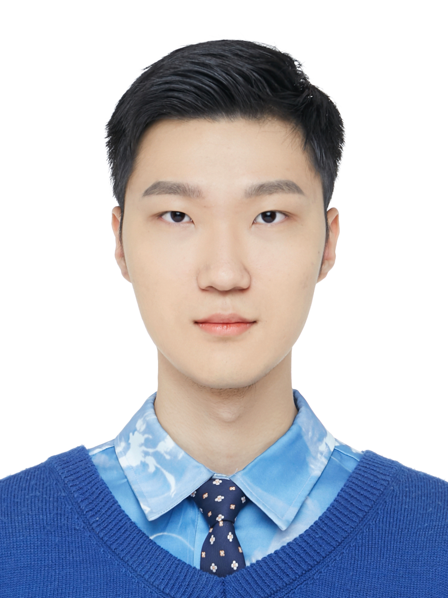
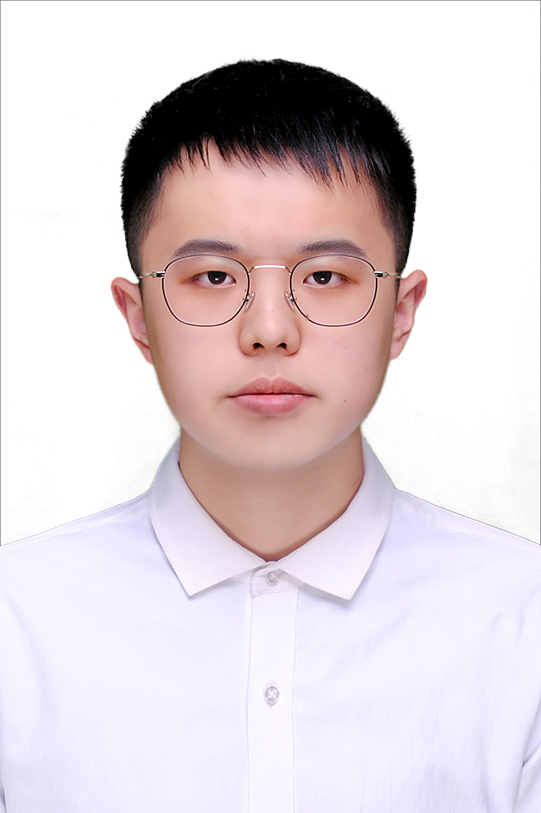

## Principle Investigator

    
    

        
Enyan Dai, Assistant Professor

        

        Enyan obtained his Ph.D. from the Pennsylvania State University. He has published over 30 papers in top-tier venues including Spotlight in ICLR, KDD, NeurIPS,  WWW, TKDE etc. Untill 2025, his Google Scholar Citation is 1900+ with H-index as 18.
         
        <b> Research Interests</b>
        <li>Foundational Research: Trustworhty AI & Graph Mining, Graph Foundation Model </li>
        <li>Applications: AI for Protein Analysis, AI for Sports</li>
        

    

    

## Students

    

        
         
        <a href="https://yuliangyan0807.github.io/" class="name">Yuliang Yan, Ph.D. student</a>
        
Master from Fudan University

    

    

        
         
        <a href="" class="name"> Shuo Yan，Ph.D. student</a>
        
Master from UCAS

    

    

        
         
        <a href="" class="name"> Bin Ma，RA</a>
        
Bachelor from Xian Jiaotong University

    

    

        
         
        <a href="" class="name"> Chenao Li，Ph.D. student</a>
        
Master from UCAS

    

    

        
         
        <a href="" class="name"> Yaochi Zhou，Ph.D. student</a>
        
Bachelor/Master from USTC/UCAS

    

    

        
         
        <a href="" class="name"> Yuxiang Zhang，RA</a>
        
Bachelor/Master from Xidian/UCAS

    

    

        
         
        <a href="" class="name">Jiahua Lu，visiting student</a>
        
Master Student from Jilin University

    

    

        
         
        <a href="" class="name">Haochun Tang, visiting student</a>
        
Master Student from Jilin University

    

    

        We want you!
    

